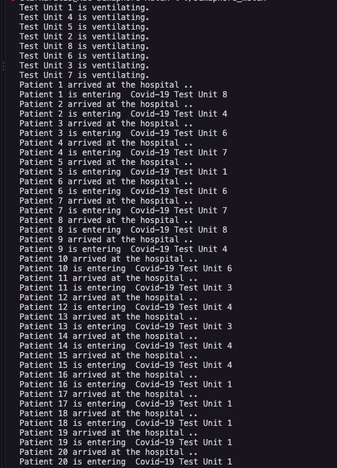

# Semaphore Mutex

## English

This repository contains a C program that simulates a COVID-19 test unit scenario by using POSIX threads and semaphores.

Patients arrive at the hospital, enter available test units, wait for the unit to fill, and then the unit starts the vaccination process. The project demonstrates basic synchronization concepts such as:

- Threads
- Semaphores
- Mutex-like access control
- Shared counter management
- Critical sections

### Files

- `2016510001.c` contains the simulation source code.
- `screenshots/program-output.png` contains a sample output screenshot.

### How to Build

Compile the program with pthread support:

```bash
cc -Wall -Wextra -pthread 2016510001.c -o semaphore_mutex
```

### How to Run

```bash
./semaphore_mutex
```

### Notes

The output order can change between runs because multiple threads execute concurrently.

### Screenshots



## Turkce

Bu repo, POSIX thread ve semaphore kullanarak COVID-19 test birimi senaryosunu simule eden bir C programi icerir.

Hastalar hastaneye gelir, uygun test birimlerine girer, birimin dolmasini bekler ve ardindan ilgili birimde asilama sureci baslar. Proje temel senkronizasyon kavramlarini gostermek icin hazirlanmistir:

- Thread'ler
- Semaphore kullanimi
- Mutex benzeri erisim kontrolu
- Ortak sayac yonetimi
- Kritik bolgeler

### Dosyalar

- `2016510001.c` simulasyon kaynak kodunu icerir.
- `screenshots/program-output.png` ornek cikti ekran goruntusunu icerir.

### Nasil Derlenir

Programi pthread destegiyle derleyin:

```bash
cc -Wall -Wextra -pthread 2016510001.c -o semaphore_mutex
```

### Nasil Calistirilir

```bash
./semaphore_mutex
```

### Notlar

Program birden fazla thread kullandigi icin cikti sirasi her calistirmada degisebilir.

### Ekran Goruntuleri


